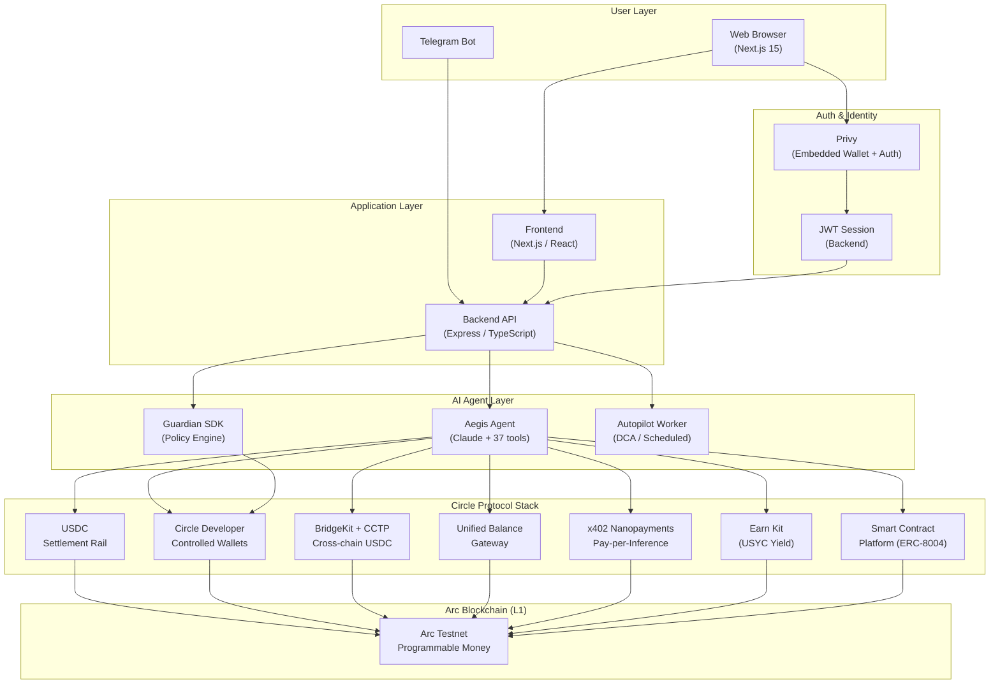
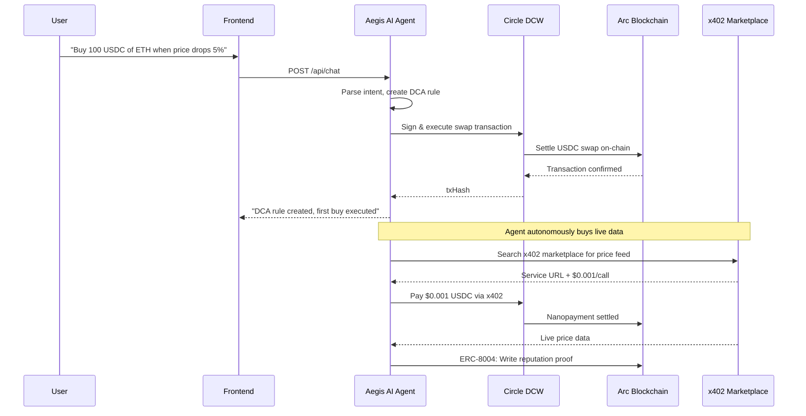
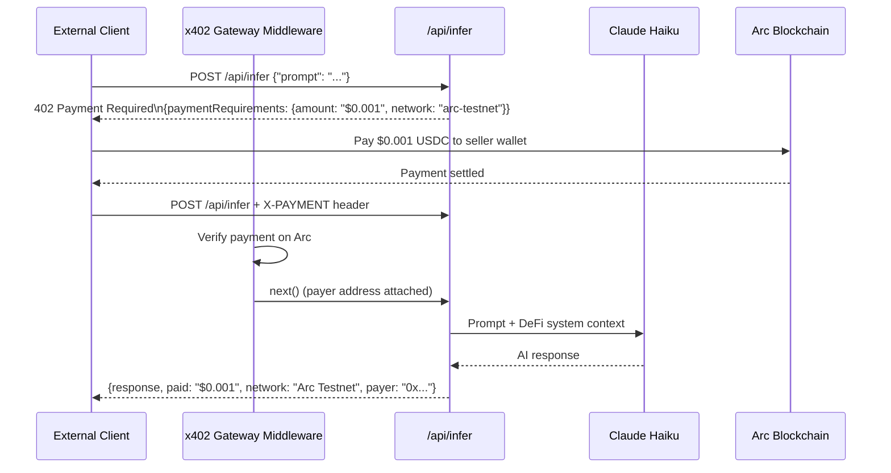
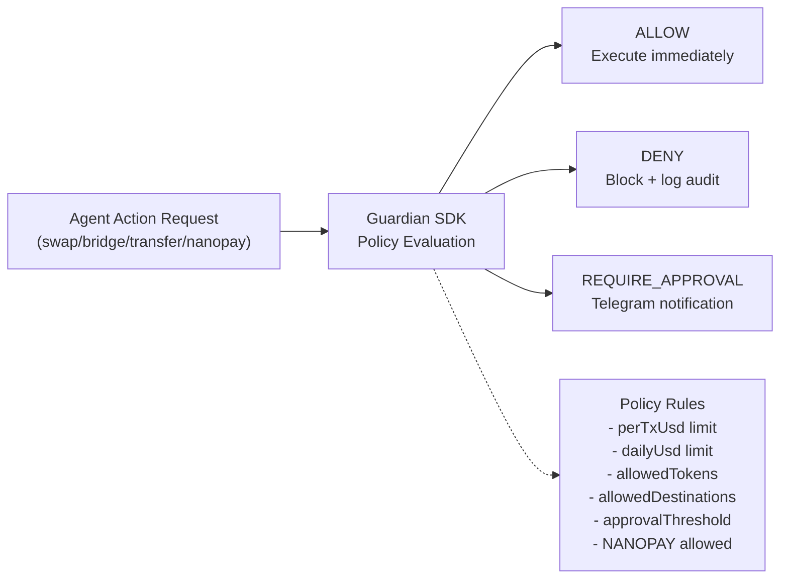

# GuardAgentAI

**Autonomous AI agents for stablecoin operations - with a Guardian policy that catches every move before it lands on-chain.**

Live at **[guardagent.org](https://guardagent.org)** · Built on **[Arc](https://www.circle.com/arc)**

Hackathon entry: **Build on Arc** by Circle, **Agentic Economy track** (also qualifies for the DeFi track). Final submission: 2026-08-09.

---

## The problem

Agentic commerce is here - agents that swap, bridge, settle escrows, and pay each other autonomously. The Circle stack ships the pieces (Wallets, CCTP, Swap Kit, ERC-8004 reputation, ERC-8183 escrow) but leaves the safety question open: **what stops a hallucinated address, a runaway loop, or a compromised LLM from draining the wallet?**

Most projects bolt on a confirmation step. That breaks autonomy.

## What we do differently

Every action a GuardAgentAI agent attempts goes through **Guardian** - a policy engine that pre-checks the call against per-tx caps, daily limits, allow/block-lists, and slippage bounds. Allow → execute on-chain. Block → log it. Above-threshold → Telegram 2FA before sign-off.

The agent stays fully autonomous within its rails. The user stays in control without sitting in front of the screen.

This is the differentiator: **Guardian-as-canon** for agentic commerce. Everything else (Aegis chat, Jobs escrow, CCTP bridge, Swap Kit FX) is built on top.

---

## The product, in four surfaces

| Surface | What it does |
|---|---|
| **Guardian** | The policy you write once. `/guardian` has a live editor + dry-run console - change a rule, see exactly which past actions would have been blocked. |
| **Aegis** | The AI agent. 37 tools spanning swap, bridge, jobs, reputation, send, faucet. Talk in `/chat`. Every tool call is pre-checked by Guardian. |
| **Wallet** | The agent's Circle Developer-Controlled Wallet on Arc. `/wallet` is the treasury cockpit - balances, swap-hero, transaction ledger. |
| **Jobs** | ERC-8183 agentic commerce escrow. Client posts a job, provider delivers, evaluator approves, USDC settles. `/jobs` has the full lifecycle stepper. |

Plus an instructional audit trail (`/audit`), a live `eth_getLogs` indexer (`/activity`), watchers (`/alerts`), and a control surface (`/settings`).

### Pay-per-inference API (Nanopayments) - verify it yourself

GuardAgent AI exposes a public **x402 Nanopayments** endpoint, no account and no API key. Anyone can confirm it is live in two commands:

```bash
# 1. Discover pricing and supported networks (open in a browser too)
curl https://api.guardagent.org/api/infer/info

# 2. Ask without paying → the endpoint answers with a real x402 challenge
curl -i -X POST https://api.guardagent.org/api/infer \
  -H "Content-Type: application/json" \
  -d '{"prompt": "What is the current yield on USYC?"}'
```

Step 2 returns **`HTTP 402 Payment Required`** with a base64 `PAYMENT-REQUIRED` header (x402 v2). Decoded, it asks for **$0.001 USDC** (1000 units), settling to `0x8f6ee69acf6fbe973d52014be8ee55e96867d942`, payable on any of four networks:

| Network | CAIP-2 | Price |
|---|---|---|
| **Arc Testnet** | `eip155:5042002` | $0.001 |
| Base Sepolia | `eip155:84532` | $0.001 |
| Ethereum Sepolia | `eip155:11155111` | $0.001 |
| Arbitrum Sepolia | `eip155:421614` | $0.001 |

That 402 handshake **is** the proof the agentic-economy loop is real: an AI service that charges per call, settled on-chain, machine-to-machine. To complete a payment, an x402 client (e.g. `circle services pay`) signs the $0.001 authorization and resends with an `X-PAYMENT` header. Server middleware: `@circle-fin/x402-batching`. See [Circle Nanopayments docs](https://developers.circle.com/stablecoins/nanopayments).

---

## Circle products used on Arc

| Product | Integration | Route / Service |
|---|---|---|
| **USDC** | Primary settlement for all transactions (swaps, bridges, escrow, nanopayments) | All routes |
| **Circle Wallets (DCW)** | Agent execution wallet - signs every on-chain action, bounded by Guardian policy | `arckit.ts`, `/api/agent-wallet` |
| **CCTP / Bridge Kit** | Cross-chain USDC transfers: Arc → Base, Arc → Ethereum. Full lifecycle tracked. | `arcBridge.ts`, `/api/bridge` |
| **Circle Gateway (Unified Balance)** | Multi-chain USDC balance aggregation across 8 testnet chains | `arcGateway.ts` |
| **Nanopayments (x402)** | Pay-per-inference AI endpoint. Any wallet pays $0.001 USDC/query, no account needed. | `/api/infer` |
| **Earn Kit (USYC)** | Yield-bearing USDC - Aegis can allocate idle treasury to earn | `arcEarn.ts` |
| **Smart Contract Platform** | ERC-8004 Reputation Registry, ERC-8183 escrow jobs lifecycle | `arcReputation.ts`, `arcJobs.ts` |
| **Custom Fee** | bps fee taken on every bridge and swap via the Bridge/Swap Kit native `customFee` parameter (revenue path) | `customFee.ts`, `arcBridge.ts`, `arcFx.ts` |
| **Swap Kit** | USDC ↔ EURC on-chain swap with live price quotes | `arcFx.ts` |

---

## How we map to the Build on Arc tracks

**Agentic Economy track**

| Required | In GuardAgentAI |
|---|---|
| **Decision logic tied to real signals** | Worker scans Pyth + CoinGecko prices every 60s, evaluates user rules, walks a 3-level escalation ladder, and fires protective swaps in AutoMode. |
| **Autonomous spending / settlement** | Balance-triggered CCTP bridge rules run worker to Guardian to execution with no human in the loop. Every spend path re-validated by Guardian policy. |
| **Nanopayments for micro-transactions** | `/api/infer` charges $0.001 USDC per AI query via x402 + Circle Gateway. Aegis also pays external x402 services from its own capped wallet. |
| **USDC-denominated autonomy** | All Guardian caps, daily limits, ledgers, and fees are USD-denominated. Arc uses USDC as native gas, so no separate gas token or paymaster is needed. |

**DeFi track**

| Required | In GuardAgentAI |
|---|---|
| **Advanced programmable logic (USDC/EURC)** | Swap Kit FX at oracle rates, limit orders, DCA schedules, Earn Kit yield, all bounded by slippage and policy checks. |
| **Conditional flows / multi-step settlement** | Rule, alert, Telegram 2FA, auto-execute pipeline. CCTP burn-attest-mint with a stuck-bridge reconciler every 3 minutes. |
| **Cross-chain liquidity, Arc as hub** | CCTP bridge from Arc to Base and Ethereum Sepolia plus Gateway unified balance across chains. |

CCTP bridge is the moneyshot: burn on Arc Testnet, mint on Base Sepolia, real txhashes both sides.

---

## Demo path (what a judge sees)

### Full product demo (3 min)

1. Sign in at [guardagent.org](https://guardagent.org) (Privy email OTP).
2. Dashboard shows a **first-run checklist** - three steps to a live demo.
3. Click **Drop $100 USDC + Gas** → agent wallet funded from the Arc faucet.
4. Open **Guardian** → set `Max $20 per tx`, `Daily cap $100`. Dry-run any past action to see Allow/Block decisions.
5. Open **Chat** → type *"Bridge 1 USDC to Base"*. Aegis quotes (forwarder + kit fees), Guardian pre-checks, executes. Real txhash returned on both chains.
6. Open **Audit** → see the Guardian verdict for that bridge in the forensic timeline.
7. Open **Jobs** → create an ERC-8183 escrow → walk through Draft → Post → Fund → Submit → Settle.

Total on-chain actions: ~8 across 3 chains in under 3 minutes.

### Nanopayments demo (30 sec, no login required)

```bash
# Step 1: discover the endpoint
curl https://api.guardagent.org/api/infer/info

# Step 2: send a query (x402 client handles the $0.001 USDC payment automatically)
x402-fetch POST https://api.guardagent.org/api/infer \
  --wallet <your-arc-wallet-key> \
  --body '{"prompt":"What yield does USYC offer on Arc?"}'
# Response: {"response":"USYC currently offers...","paid":"$0.001","network":"Arc Testnet","payer":"0x..."}
```

This demonstrates the full Agentic Economy loop: any AI client pays per query in USDC on Arc, no account, no API key - pure onchain settlement.

---

## Stack

- **Backend:** Node.js + Express + Prisma + Postgres + BullMQ (Redis)
- **Frontend:** Next.js 15 (App Router) + custom design system (`.ga-*` classes, no UI library)
- **Worker:** BullMQ consumer for price scans, balance triggers, escalation ladder
- **Bot:** Telegraf - 2FA approval flow for above-threshold actions
- **Auth:** Privy (email OTP, no password/seed)
- **Circle SDKs:** Bridge Kit, Swap Kit, USDC Kit, Earn Kit, Unified Balance Kit (Gateway), x402 Nanopayments, Smart Contract Platform, Developer-Controlled Wallets, User-Controlled Wallets (native `customFee` for the revenue path)
- **Chain:** Arc Testnet (5042002) - plus Base Sepolia and Ethereum Sepolia for CCTP destinations

## Local dev

```bash
cp .env.example .env   # fill Circle, Privy, JWT, Postgres URLs
mkdir -p backups       # bind target for the db backup volume
docker compose up -d   # postgres, redis, backend, frontend, worker, bot
docker compose exec backend npx prisma migrate deploy --schema packages/backend/prisma/schema.prisma
```

Frontend at `:3009`, backend at `:3010`, ports forwarded by Caddy in production.

For local type-checking without Docker, generate the Prisma client and build the workspace packages first so `npx tsc` resolves cleanly (otherwise the workspace imports and Prisma types read as missing):

```bash
npm install
npm run build --workspaces --if-present   # @guardagent/guardian, circle-public-rpc-adapter
npx prisma generate --schema packages/backend/prisma/schema.prisma
```

---

## Architecture



### Agentic Economy flow



### Nanopayments flow (pay-per-inference)



### Guardian policy engine



---

## Hackathon context

**Build on Arc** (Circle's 4-week online hackathon)
- Tracks entered: Agentic Economy (primary), DeFi
- Checkpoints: idea 2026-07-19, repo 2026-07-26, final MVP + video + deck 2026-08-09
- Demo Day: 2026-08-20, top teams enter an 8-week accelerator

GuardAgentAI competes on **agentic commerce safety**, not on payment volume. The Guardian policy engine is the differentiator: autonomous agents with real spending limits, not toy demos.

---

## Circle Product Feedback

See [CIRCLE_PRODUCT_FEEDBACK.md](CIRCLE_PRODUCT_FEEDBACK.md) for our detailed evaluation of every Circle product used, what worked well, and improvement recommendations.

---

Built by [@0xFearless_](https://github.com/0xFearless-1). Questions, problems, ideas → open an issue.
